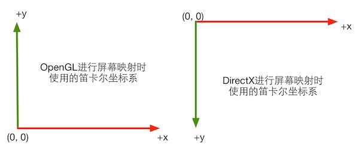
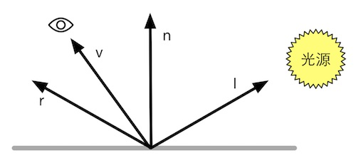
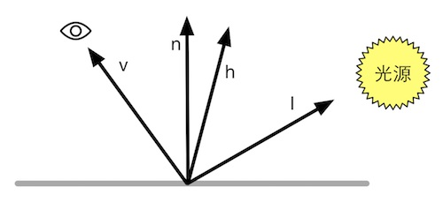

# Unity-shader入门精要

## 目录

* [目录](#目录)
* [欢迎来到Shader的世界](#欢迎来到shader的世界)
* [渲染流水线](#渲染流水线)
  * [综述](#综述)
    * [什么是流水线](#什么是流水线)
    * [什么是渲染流水线](#什么是渲染流水线)
  * [CPU与GPU之间的通信](#cpu与gpu之间的通信)
    * [把数据加载进显存](#把数据加载进显存)
    * [设置渲染状态](#设置渲染状态)
    * [调用Draw Call](#调用draw-call)
  * [GPU流水线](#gpu流水线)
    * [概述](#概述)
    * [顶点着色器(Vertex Shader)](#顶点着色器vertex-shader)
    * [裁剪(Clipping)](#裁剪clipping)
    * [屏幕映射(Screen Mapping)](#屏幕映射screen-mapping)
    * [三角形设置(Triangle Setup)](#三角形设置triangle-setup)
    * [三角形遍历(Triangle Traversal)](#三角形遍历triangle-traversal)
    * [片元着色器(Fragment Shader)](#片元着色器fragment-shader)
    * [逐片元操作(Per-Fragment Operation)](#逐片元操作per-fragment-operation)
    * [总结](#总结)
  * [一些容易困惑的地方](#一些容易困惑的地方)
    * [关于Draw Call](#关于draw-call)
    * [关于固定管线渲染(Fixed Pipeline)](#关于固定管线渲染fixed-pipeline)
* [Unity Shader基础](#unity-shader基础)
  * [Unity Shader概述](#unity-shader概述)
    * [材质(Material)和Unity Shader](#材质material和unity-shader)
    * [Unity中的材质](#unity中的材质)
    * [Unity中的Shader](#unity中的shader)
  * [Unity Shader的基础: ShaderLab](#unity-shader的基础-shaderlab)
  * [Unity Shader的结构](#unity-shader的结构)
  * [Unity Shader的形式](#unity-shader的形式)
    * [表面着色器(Surface Shader)](#表面着色器surface-shader)
    * [顶点/片元着色器(本书重点使用部分)](#顶点片元着色器本书重点使用部分)
    * [固定函数着色器(别用了)](#固定函数着色器别用了)
  * [一些容易困惑的地方](#一些容易困惑的地方-1)
    * [Unity Shader != Shader](#unity-shader--shader)
    * [Unity Shader与CG/HLSL之间的关系](#unity-shader与cghlsl之间的关系)
* [学习Shader所需的数学基础](#学习shader所需的数学基础)
  * [笛卡尔坐标系](#笛卡尔坐标系)
  * [点和向量](#点和向量)
  * [矩阵](#矩阵)
    * [矩阵的几何意义: 变换](#矩阵的几何意义-变换)
  * [坐标空间](#坐标空间)
    * [模型空间(Model Space)](#模型空间model-space)
    * [世界空间(World Space)](#世界空间world-space)
    * [观察空间(View Space)](#观察空间view-space)
    * [裁剪空间(Clip Space)](#裁剪空间clip-space)
    * [屏幕空间(Screen Space)](#屏幕空间screen-space)
    * [总结](#总结-1)
  * [法线变换](#法线变换)
  * [Unity Shader的内置变量](#unity-shader的内置变量)
  * [一些容易困惑的地方](#一些容易困惑的地方-2)
    * [使用3\*3矩阵还是4\*4矩阵](#使用33矩阵还是44矩阵)
    * [CG中的矢量与矩阵类型](#cg中的矢量与矩阵类型)
    * [Unity中的屏幕坐标: ComputeScreenPos/VPOS/WPOS](#unity中的屏幕坐标-computescreenposvposwpos)
* [开始Unity Shader学习之旅](#开始unity-shader学习之旅)
  * [环境介绍](#环境介绍)
  * [一个最简单的顶点/片元着色器](#一个最简单的顶点片元着色器)
    * [顶点/片元着色器的基本结构](#顶点片元着色器的基本结构)
    * [模型数据从哪来](#模型数据从哪来)
    * [顶点着色器和片元着色器之间如何通信](#顶点着色器和片元着色器之间如何通信)
    * [如何使用属性](#如何使用属性)
  * [Unity提供的内置文件和变量](#unity提供的内置文件和变量)
  * [Unity提供的CG/HLSL语义](#unity提供的cghlsl语义)
    * [Unity支持的语义](#unity支持的语义)
  * [Shader的debug](#shader的debug)
    * [使用假彩色图像](#使用假彩色图像)
    * [通过VS](#通过vs)
    * [通过Unity的帧调试器(Frame Debugger)](#通过unity的帧调试器frame-debugger)
  * [小心渲染平台的差异](#小心渲染平台的差异)
    * [渲染纹理坐标的差异](#渲染纹理坐标的差异)
    * [Shader语法差异](#shader语法差异)
    * [Shader语义差异](#shader语义差异)
  * [Shader整洁之道](#shader整洁之道)
    * [float half fixed](#float-half-fixed)
    * [避免不必要的计算](#避免不必要的计算)
    * [慎用分支与循环](#慎用分支与循环)
    * [不要除以0](#不要除以0)
* [Unity中的基础光照](#unity中的基础光照)
  * [我们是如何看到这个世界的](#我们是如何看到这个世界的)
    * [光源](#光源)
    * [吸收与散射](#吸收与散射)
    * [着色(shading)](#着色shading)
    * [BRDF光照模型](#brdf光照模型)
  * [标准光照模型](#标准光照模型)
    * [逐像素还是逐顶点计算](#逐像素还是逐顶点计算)
  * [Unity中的环境光与自发光](#unity中的环境光与自发光)
  * [在Unity Shader中实现漫发射光照模型](#在unity-shader中实现漫发射光照模型)
    * [逐顶点光照的实现](#逐顶点光照的实现)
    * [逐像素光照的实现](#逐像素光照的实现)
    * [半兰伯特(Half Lambert)模型](#半兰伯特half-lambert模型)
  * [在Unity Shader中实现高光反射光照模型](#在unity-shader中实现高光反射光照模型)
    * [实践: 逐顶点光照](#实践-逐顶点光照)
    * [实践: 逐像素光照](#实践-逐像素光照)
    * [Blinn-Phong光照模型](#blinn-phong光照模型)
  * [使用Unity内置的函数](#使用unity内置的函数)

## 欢迎来到Shader的世界

大体的介绍了一下全书结构, 鼓励了一下菜鸟们继续学习

## 渲染流水线

Dx11的渲染管线大致了解了一下, 可以借此机会深入理解

### 综述

shader只是渲染流水线中的一个部分

#### 什么是流水线

性能瓶颈出现在流水线中最慢工序, 理想状态下一个非流水系统分为 n 个时长相同的流水线阶段, 整个系统得到 n 倍速度提升

#### 什么是渲染流水线

*Real-Time Rendering, Third Edition* 提到的三个概念性阶段:
应用阶段(Application Stage) 几何阶段(Geometry Stage) 光栅化阶段(Rasterizer Stage)

##### 应用阶段

由应用主导, 通过CPU负责, 主要任务有三个

* 准备场景数据: 摄像机位置, FOV, 模型, 光源等
* 粗粒度剔除(Culling): 不可见的片面剔除(原来culling的翻译是这个)
* 设置渲染状态: 设置渲染材质, 纹理, shader, 输出渲染图元(Rendering primitives), 将点线面这样的渲染图元传递给几何阶段

本书非重点部分

##### 几何阶段

GPU负责, 与图元进行交互, 决定绘制什么, 如何绘制, 在哪绘制

也就是将顶点坐标变换到屏幕空间, 然后给光栅阶段, 包含坐标, 深度值, 着色等信息

##### 光栅化阶段

通过GPU产生显示在屏幕上的像素, 并渲染出最终图像

决定哪些像素会被绘制到屏幕上

### CPU与GPU之间的通信

渲染流水线起点在CPU, 也就是应用阶段, 分为以下三步

* 数据加载进显存
* 设置渲染状态
* 调用Draw Call

#### 把数据加载进显存

HDD -> RAM -> 显存, CPU将数据从硬盘放入内存, 然后被加载到GPU能够直接访问的显存上, 之后移除内存内容, 最后通过CPU设置渲染状态来控制GPU

#### 设置渲染状态

定义网格如何被渲染: 包括材质, 光源属性, 各种着色器等等

#### 调用Draw Call

由CPU发起, 交给GPU, 对象是一个需要被渲染的图元列表

调用后, 根据之前的渲染状态和数据进行计算渲染, 最终呈现到屏幕像素上

### GPU流水线

针对的是GPU得到CPU的渲染命令进行的流水线流程, 将图元渲染到屏幕上

#### 概述

简单的介绍, 光栅化阶段可以详细看看

#### 顶点着色器(Vertex Shader)

* 坐标变换: 从模型空间转换到齐次裁剪空间, 之后由硬件进行透视除法,
最终得到一个归一化的设备坐标(Normalized Device Coordinates, NDC)
* 逐顶点光照

#### 裁剪(Clipping)

将部分在视野外的图元进行处理, 产生新的顶点信息, 抛弃旧的在视野外的顶点

#### 屏幕映射(Screen Mapping)

将三维坐标转换为二维坐标

OpenGL与DirectX的差异: 前者规定(0,0)为左下角, 后者规定为左上角

#### 三角形设置(Triangle Setup)

计算光栅化一个三角网格所需要的信息

#### 三角形遍历(Triangle Traversal)

检查每个像素是否被三角网格覆盖, 如果有则生成片元(fragment)(听着就牛逼的翻译), 又称扫描变换(Scan Conversion)

片元中的状态是对三个顶点的信息进行插值得到的
例如, 对图2.12中三个顶点的深度进行插值得到其重心位置对应的片元的深度值为-10.0

片元是包含了很多状态的集合(并不是一个像素点), 比如坐标, 深度信息, 以及之前输出的顶点信息, 如法线, 纹理坐标


#### 片元着色器(Fragment Shader)

在Dx中称为**像素着色器(Pixel Shader)**

这里可以进行**纹理采样**, 通常在顶点着色器中输入纹理坐标
经过光栅化三个阶段对三角网格三个顶点进行插值就可以得到覆盖片元的纹理坐标


而上述的计算只能应用于独立的每一个片元, 无法将自己的结果发给其他片元

**例外情况:** 片元着色器可以访问导数信息(gradient or derivative), 详见扩展

TODO[]: 后面补充一个链接

#### 逐片元操作(Per-Fragment Operation)

Dx中称为**输出合并阶段(Output Merger)**

* 决定每个片元可见性
* 片元颜色与颜色缓冲区的颜色合并或者说混合(Blending)

下面这张图, 就让我知道了啥是**深度模板缓冲(Depth/Stencil)**


只有通过了所有的测试后, 新生成的片元才能和颜色缓冲区中已经存在的像素颜色进行混合, 最后再写入颜色缓冲区中

如果没有通过测试, 则片元舍弃


* 模板测试通常用于限制渲染区域, 还可以用于渲染阴影, 轮廓渲染等等
* 深度测试用于覆盖, 即离摄像机更远的片元深度更大, 因此会被舍弃, 从而只显示更近的
* 注意:
  * 没通过深度测试, 被丢弃的片元不能更改深度缓冲的值
  * 无论是否通过模板测试, 都能对模板缓冲进行更改

之后就是合并部分, 每个像素信息都被存在了颜色缓冲中, 一个接着一个物体渲染就需要考虑是否进行覆盖之类的

* 不透明的物体可以关闭混合(Blending), 这样就可以直接覆盖
* 半透明的物体就需要混合来产生透明的效果


不过测试顺序不唯一, 可能在片元着色器之前就测试, 这样降低生成片元的数量

另外片元中不包含透明度信息, 因此与测试冲突

#### 总结

不同资料在此处提及不同, 可能是不同图形接口, 也可能是GPU进行不同的底层优化

### 一些容易困惑的地方

不太困惑的地方就看一遍跳过

#### 关于Draw Call

本质: CPU调用图像编程接口, 如DX中的DrawIndexedPrimitive

* CPU和GPU是如何实现并行工作的?

使用命令缓冲区(command buffer), CPU向其中的命令队列加命令, GPU读命令, Draw Call属于其中的命令之一

* 为何Draw Call次数多会影响帧率

CPU会消耗大量资源向GPU发送内容, 而GPU进行渲染速度很快, 因此GPU会闲

* 如何减少Draw Call次数

方法很多, 这里只说了批处理(Batching), 比较适合静态的物体
将多个静态物体合并网格(相当于合并小的Draw Call形成一个大的)


合并也比较消耗CPU, 因此注意

* 避免使用大量的小网格并考虑能否合并
* 避免使用过多材质, 使得不同网格共用一个材质(说的就是你们那些艺术家, 创意工坊的资产片面用那么多, 游戏里又体现不出来, 老夫的1060在咆哮了)

#### 关于固定管线渲染(Fixed Pipeline)

固定函数的流水线也就是固定管线

提供了一系列接口, 这些接口包含了一个特定功能的函数入口点

是被淘汰掉的玩意儿(目前用可编程管线来模拟)

## Unity Shader基础

前面的示例代码让我想起了隔壁的项目Dx11Tutorial, 好复杂

### Unity Shader概述

#### 材质(Material)和Unity Shader

通常流程:

* 创建一个material
* 创建一个Unity Shader, 赋予之前的material
* material赋予给渲染对象
* material面板调整Shader属性

Shader中带有渲染所需的代码, 属性, 指令
我们可以通过material来调节这些属性, 并赋予给相应的模型

#### Unity中的材质

简单的介绍了一下

#### Unity中的Shader

* standard surface shader: 包含标准光照模型的表面着色器模板
* Unlit shader: 不包含光照但包含雾效的基本顶点片元着色器(本文常用)
* Image Effect Shader: 各种屏幕后处理效果的模板
* Compute Shader: 特殊的shader文件, 利用GPU并行性进行与常规渲染流水线无关的计算(与本文无关)

### Unity Shader的基础: ShaderLab

一种专门为Unity Shader服务的语言

类似DirectX的Effects语言(.FX)

### Unity Shader的结构

非常粗糙地介绍了一遍, 懂的人肯定自然就懂, 对于我这种Unity都没用过几次, 从未接触过Unity Shader的人来看
看了等于白看, 可能Unity版本太新?可能文章后面会详细介绍?

### Unity Shader的形式

shader的代码基本被包含在shaderLab语义块中

#### 表面着色器(Surface Shader)

Unity自创的, 渲染代价高, 还是将代码转换成对应的顶点/片元着色器, 是对顶点/片元着色器的一层抽象

HLSL编写的代码块嵌套在subshader中的CGPROGRAM和ENDCG中

```Unity Shader
Shader "Custom/Template"{
    SubShader{
        Tags{"RenderType"="Opaque"}
        CGPROGRAM
        #pragma surface surf Lambert
        //CG/HLSL代码块

        ENDCG
    }
    Fallback "Diffuse"
}
```

#### 顶点/片元着色器(本书重点使用部分)

和表面着色器一样, HLSL编写的代码块嵌套在CGPROGRAM和ENDCG中, 但是顶点/片元着色器写在PASS语义块中

#### 固定函数着色器(别用了)

用于支持老旧的固定管线

### 一些容易困惑的地方

#### Unity Shader != Shader

Unity Shader实际上是一个.shader后缀的ShaderLab文件, 与第二章的shander不同

两者对比:

* 传统shader只可以编写特定的着色器, Unity Shader可以在同一个文件中包含需要的顶点着色器与片元着色器
* 传统shader无法进行渲染设置, 如混合开启, 深度模板测试等等, Unity Shader可以通过一行特定的指令完成设置
* 传统shader代码冗长, Unity Shader只需要在特定语句块中声明一些属性, 且拥有许多模板自带的属性
* 传统shader比Unity Shader更加灵活, 可以提供更多种类着色器

#### Unity Shader与CG/HLSL之间的关系

可以通过CG/HLSL语言在Shaderlab内部嵌套来实现表面着色器与片元着色器

## 学习Shader所需的数学基础

### 笛卡尔坐标系

* 二维笛卡尔坐标系:
  * 包含一个原点+两条过原点互相垂直的基矢量(basis vector)
* 三维笛卡尔坐标系:
  * 一个原点+三条互相垂直的基矢量
    * 标准正交基(orthnormal basis): 长度为1互相垂直
    * 正交基(orthogonal basis): 互相垂直长度不为1
* 左手坐标系与右手坐标系使得坐标指向不同
  * 二维坐标系可以通过简单的旋转使得xy两轴指向的方向一致
  * 三维则做不到上述, 因此需要划分左右手坐标系
  * 旋向性(handedness), 相同的旋向性就能通过旋转使得他们坐标重合
* 左右手法则: 用来确定不同坐标系对正向旋转的定义
  * 为了达到同样的视觉效果, 不同坐标系经过的数学运算也不同, 因此可能需要用到坐标系的转换
* Unity使用的坐标系:
  * 模型空间与世界空间: 左手坐标系
  * 观察空间: 右手坐标系

### 点和向量

* 点积(dot): 几何意义是投影
  * 可用于比较两个向量模的大小: 不开方以降低运算量
* 叉积(cross product & outer product): 几何意义是构成平行四边形, 从而判断片面的方向
  * 获得同时垂直于两个矢量的新矢量
  * 方向判断: 左手坐标系下用左手法则, 右手坐标系下用右手法则

### 矩阵

一些简单的介绍, 属于线代最基础部分

* 方阵
* 单位阵
* 转置矩阵
* 逆矩阵
* 正交阵: 方阵的转置等于其逆

#### 矩阵的几何意义: 变换

##### 什么是变换

* 线性变换: 包括旋转, 缩放, 错切(shear), 镜像(reflection), 正交投影(orthographic projection)等等
  * 满足标量乘法和矢量加法
  * 使用一个3*3的矩阵就可以表示所有的线性变换

$$
f(x)+f(y)=f(x+y)\\
kf(x)=f(kx)
$$

* 仿射变换(affine transform): 线性变换+平移变换
  * 平移变换: 只满足标量乘法
  * 使用4*4的矩阵表示, 因此需要将矢量扩展到四维空间, 也就是齐次坐标空间(homogeneous space)

##### 齐次坐标(homogeneous coordinate)

三维坐标通过w=1转换成齐次坐标

一个方向矢量通过w=0转换

##### 分解基础变换矩阵

将纯平移 纯缩放 纯旋转称为基础变换矩阵

$$
\begin{matrix}
  M_{3*3} & t_{3*1}\\
  0_{1*3} & 1
\end{matrix}
$$

其中左上角的3*3矩阵表示旋转与缩放, 右上角的3*1矩阵用于平移, 左下角1*3矩阵是零矩阵, 右下角的元素标量为1

##### 平移矩阵

通过以下矩阵的乘法对一个点进行平移变换

$$
\left [
\begin{matrix}
  1 & 0 & 0 & t_x\\
  0 & 1 & 0 & t_y\\
  0 & 0 & 1 & t_z\\
  0 & 0 & 0 & 1
\end{matrix}
\right ]

\left [
\begin{matrix}
  x\\
  y\\
  z\\
  1
\end{matrix}
\right ]
=
\left [
\begin{matrix}
  x+t_x\\
  y+t_y\\
  z+t_z\\
  1
\end{matrix}
\right ]

$$

很显然, 平移变换不会改变方向矢量(因为矢量没有位置属性, 对位置的修改不会对其本身进行改变)

##### 缩放矩阵

$$
\left [
\begin{matrix}
  k_x & 0 & 0 & 0\\
  0 & k_y & 0 & 0\\
  0 & 0 & k_z & 0\\
  0 & 0 & 0 & 1
\end{matrix}
\right ]

\left [
\begin{matrix}
  x\\
  y\\
  z\\
  1
\end{matrix}
\right ]
=
\left [
\begin{matrix}
  k_xx\\
  k_yy\\
  k_zz\\
  1
\end{matrix}
\right ]
$$

若$k_x=k_y=k_z$则称之为**统一缩放**(uniform scale),
否则则是非统一缩放(nonuniform scale), 后者会挤压或拉伸模型, 改变一些角度与比例信息

##### 旋转矩阵

正交阵, 其逆运算表示相反方向的旋转

##### 复合变换

将上述三种矩阵合并, 使用下列公式

$$
P_{new}=M_{translation}M_{rotation}M_{scale}P_{old}
$$

其中, 旋转的复合形式需要考虑旋转的形式, 有以下两种形式, 可以通过改变旋转顺序来得到同一个结果:

* 绕着固定的坐标系对三个坐标轴进行旋转
* 每对一个坐标轴进行旋转后, 整个坐标系也随着坐标系旋转, 得到的新坐标系后再进行旋转

### 坐标空间

坐标空间具有层次结构, 即每个坐标空间都有个父空间, 对坐标空间的变换实际上就是父空间与子空间之间对点和矢量进行变换

可以通过转换矩阵来实现点或矢量从一个空间到另一个空间的转换, 反过来的转换可以使用这个转换矩阵的逆矩阵

下面举个例子来推导转换矩阵的计算过程

$$
已知子坐标空间的一个点 A_c(a,b,c), 通过四步得到在父坐标空间的位置 A_P\\

从原点开始, 向x y z三个轴方向位移, 得到:\\

A_P=\vec{O_c}+a\vec{x_c}+b\vec{y_c}+c\vec{z_c}\\

\Rightarrow
A_P=(x_{oc},y_{oc},z_{oc})+
\left [
\begin{matrix}
  | & | & |\\
  \vec{x_c} & \vec{y_c} & \vec{z_c}\\
  | & | & |
\end{matrix}
\right ]
\left [
\begin{matrix}
  a\\
  b\\
  c
\end{matrix}
\right ]\\

为了使得形式更加简单
需要使用4*4矩阵来将矩阵的平移由加法转换为乘法\\

扩展到齐次坐标空间\\

\Rightarrow
A_P=(x_{oc},y_{oc},z_{oc},1)+
\left [
\begin{matrix}
  | & | & | & 0\\
  \vec{x_c} & \vec{y_c} & \vec{z_c} & 0\\
  | & | & | & 0\\
  0 & 0 & 0 & 1
\end{matrix}
\right ]
\left [
\begin{matrix}
  a\\
  b\\
  c\\
  1
\end{matrix}
\right ]\\

\Rightarrow A_P=
\left [
\begin{matrix}
  1 & 0 & 0 & x_{oc}\\
  0 & 1 & 0 & y_{oc}\\
  0 & 0 & 1 & z_{oc}\\
  0 & 0 & 0 & 1
\end{matrix}
\right ]
\left [
\begin{matrix}
  | & | & | & 0\\
  \vec{x_c} & \vec{y_c} & \vec{z_c} & 0\\
  | & | & | & 0\\
  0 & 0 & 0 & 1
\end{matrix}
\right ]
\left [
\begin{matrix}
  a\\
  b\\
  c\\
  1
\end{matrix}
\right ]\\

\Rightarrow
A_P=
\left [
\begin{matrix}
  | & | & | & |\\
  \vec{x_c} & \vec{y_c} & \vec{z_c} & \vec{O_c}\\
  | & | & | & |\\
  0 & 0 & 0 & 1
\end{matrix}
\right ]
\left [
\begin{matrix}
  a\\
  b\\
  c\\
  1
\end{matrix}
\right ]\\
$$

在shader中, 通常使用变换矩阵的右上角3*3方阵来对法线方向与光照方向进行空间变换, 就是因为这些变换不涉及平移变换

如果变换矩阵是正交阵的话, 我们可以提取出这个矩阵的第一列, 得到坐标空间A中的x轴在另一个坐标空间中的表示

#### 模型空间(Model Space)

又称对象空间(Object Space)或局部空间(Local Space), 每个对象都有自己独立的坐标空间

在模型空间中使用上下左右前后等方向概念, 本书称为自然方向

Unity中规定, +x对应的右, +y对应的上, +z对应的前

#### 世界空间(World Space)

通过Unity中的Transform组件中的Position属性进行调整, 如果有父节点则以其父节点模型坐标空间的原点定义Position

顶点变换的第一步就是将坐标从模型空间转换至世界空间, 称之为模型变换(Model Transform)

#### 观察空间(View Space)

又称摄像机空间(Camera Space)

Unity的坐标轴选择为, +x右方, +y上方, +z摄像机后方, 也就是在观察空间中使用右手坐标系(继承于OpenGL)

顶点从世界空间转换到观察空间是称为观察转换(View Transform), 是顶点变换的第二步

* 可以通过转换矩阵, 使得顶点从世界空间变换到观察空间
* 也可以通过位移观察摄像机至世界空间原点, 使得坐标轴与世界空间的坐标轴重合

#### 裁剪空间(Clip Space)

又称齐次裁剪空间, 使用裁剪矩阵(Clip Matrix), 又称投影矩阵(Projection Matrx)

处于本空间内的图元将会被保留, 在该空间之外的将会被剔除, 与空间边界相交的将会被裁切, 是否被裁切取决于视锥体(View Frustum)

* 视锥体: dx11教程中的Note有讲
  * 正交投影(orthographic projection): 完全保留物体的距离与角度, 常用于2D游戏中
  * 透视投影(perspective projection): 模拟人眼, 近大远小, 常用于3D游戏中

如果直接使用视锥体进行物体裁切, 那么不同视锥体就需要不同的处理过程, 计算复杂, 因此通过一个投影矩阵将顶点转换到裁切空间中

投影矩阵具有以下两个作用:

* 为投影做准备: 真正的投影是后方的齐次除法(homogeneous division), 这里的准备是为顶点w分量赋予正确的含义(距离摄像机的距离)
* 对xyz分量进行缩放, 经过缩放后直接根据w分量来判断顶点是否在裁剪空间内(缩放前w分量固定为1, 方向矢量固定为0)

##### 透视投影

* 六个裁切平面构成一个锥体
* 六个裁切平面的定义通过Unity中的从camera组件中的参数与Game视图的横纵比决定
  * camera的FOV
  * clipping planes的Near与Far参数
  * 摄像机的横纵比: Game的横纵比+Viewport Rect中的W H属性

裁剪矩阵改变了空间的旋向性, 因此原来是观察空间右手坐标系转换成了裁剪空间左手坐标系

##### 正交投影

* 六个裁切平面构成一个长方体
* 平面的定义如之前的透视投影
* 进行矩阵变换后, w分量依旧为1

#### 屏幕空间(Screen Space)

将视锥体投影到屏幕空间, 得到真正的二维空间坐标

首先进行**标准齐次除法**(homogeneous division), 又称**透视除法**(perspective division),
在OpenGL中称**归一化设备坐标**(Normalized Device Coordinates, NDC)

经过透视除法后, 原本的锥型裁剪空间(视锥体)最终变成了一个立方体(正交投影原本就是一个立方体),
因此正交投影和透视投影的视锥体在透视除法之后都变换到了一个相同的立方体内

x y分量用于投影到屏幕, z分量用于深度缓冲

#### 总结


其中只有观察空间是右手坐标系

### 法线变换

顶点中通常带有额外信息, 顶点法线(Normal & Normal Vector)就是其中之一, 用于后续处理中计算光照等等

变换法线使用之前的同一个变换矩阵可能无法保证法线的垂直性, 为了了解这个问题的产生我们引入切线(tangent & tangent vector)

* 切线与纹理空间对齐(平行), 与法线垂直
* 切线通过两个顶点的差值计算, 因此直接通过变换矩阵来进行切线变换
  * 这样变换后, 得到的新法线方向可能不与表面垂直, 因此增加新法线需要与表面垂直这个约束条件
    * 如果变换只有旋转, 那么变换矩阵就是正交阵, 可以直接通过变换矩阵来进行法线变换
    * 如果变换包含旋转和统一缩放(等比例缩放), 不包含非统一缩放, 可以利用统一缩放系数来得到变换矩阵的逆转置
    * 如果包含了非统一缩放, 就需要求解逆矩阵来得到法线变换矩阵

### Unity Shader的内置变量

本章节对Unity中自带的一些变量进行介绍, 需要用到的时候可以自行查阅Unity的官方文档

注意: 不同版本的Unity自带的变量也会不一样

### 一些容易困惑的地方

#### 使用3\*3矩阵还是4\*4矩阵

只有线性变换则使用3*3, 例如针对方向向量的变换(位移变换对其没有影响)

有平移变换的就使用4*4矩阵

注意: 变换前坐标需要转换成齐次坐标

#### CG中的矢量与矩阵类型

CG中矩阵类型都是类似float3\*3 float4\*4之类的, 而对于float3 float4这类变量, 即可以当成一个矢量, 也可以当成一个1\*n行矩阵或n*1列矩阵

注意: CG中对矩阵进行填充是以行优先, 而Unity脚本中矩阵类型Matrix4*4使用列优先, 与Unity Shader中不同

#### Unity中的屏幕坐标: ComputeScreenPos/VPOS/WPOS

可以通过两种方法获得片元的屏幕坐标

* 在片元着色器中的输入声明VPOS与WPOS语义
  * VPOS是HLSL中对屏幕坐标的语义, WPOS是CG中对屏幕坐标的语义, 两者在Unity Shader中等价
    * 是个float4类型
      * xy代表屏幕坐标
      * z代表摄像空间中距离近裁切面与远裁切面的距离(0~1)
      * 如果是正交投影则w恒为1, 如果是透视投影, 则w范围$[\frac{1}{Near},\frac{1}{Far}]$
    * 最后将屏幕空间除以屏幕分辨率得到视口空间坐标
      * 视口空间就是屏幕归一化, 左下角(0,0) 右上角(1,1)
* 通过Unity提供的ComputeScreenPos函数
  * 顶点着色器中保存结果
  * 片元着色器进行齐次除法后得到视口空间的坐标
    * 为啥不一步到位: 顶点着色器到片元着色器中有一个插值的过程, 插值前进行除法会使得插值结果不正确
  * zw的值就是插值过后裁剪空间中的zw值

## 开始Unity Shader学习之旅

### 环境介绍

[README](README.md)

### 一个最简单的顶点/片元着色器

[SimpleShader](/New%20Unity%20Project/Assets/Shader/Chapter5/SimpleShader.shader)

#### 顶点/片元着色器的基本结构

* 无需Properties, 非必须
* Subshader中不需要进行任何渲染设置与标签设置, 因此使用默认设置
  * 定义了一个Pass, 其中同样没有进行设置
    * 其中CGPROGRAM与ENDCG包围了CG代码片段, **本次重点**

#### 模型数据从哪来

自定义的结构体结构如下

```shaderlab
struct StructName{
    Type Name : Semantic;
};
```

其中语义的数据从Unity中的使用该材质的Mesh Render组件提供, 每帧调用Draw Call的时候, Mesh Render
将它负责的渲染模型数据发送给Unity Shader

#### 顶点着色器和片元着色器之间如何通信

* 顶点着色器的输出结构必须包含SV_POSITION结构, 否则渲染器无法得到裁剪空间中的坐标, 从而无法将顶点渲染到屏幕上
* 顶点着色器是逐顶点调用, 片元着色器逐片元调用, 片元着色器的输入实际上就是把顶点着色器的输出进行插值后得到的结果

#### 如何使用属性

写在properties中的属性, 需要在CG代码中声明一个与属性对应的类型变量才能够访问(废话 不同代码块当然要这样)

| ShaderLab属性类型 |      CG变量类型       |
| :---------------: | :-------------------: |
|   Color, Vector   | float4, half4, fixed4 |
|   Range, Float    |  float, half, fixed   |
|        2D         |       sampler2D       |
|       Cube        |      samplerCube      |
|        3D         |       sampler3D       |

### Unity提供的内置文件和变量

包含文件(includ file), 后缀.cginc, 类似c++的头文件, 使用方法如下

```shaderlab
CGPROGRAM
//...

#include "UnityCG.cginc"

//...
ENDCG
```

### Unity提供的CG/HLSL语义

语义(semantic), 可以见微软DX的文档中<https://docs.microsoft.com/zh-cn/windows/win32/direct3dhlsl/dx-graphics-hlsl-semantics>

其中Unity会对一些语义进行特殊的规定, 以方便模型数据的传输, 如TEXCOORD0, 在a2f结构体中有"第一组纹理坐标"这个特殊含义

在DirectX10后, 有新的语义类型, 系统数值语义(system-value semantic), 开头以SV开头, 在渲染流水线中有特殊意义

#### Unity支持的语义

应用阶段传递模型数据给顶点着色器的常用语义(顶点着色器输入)

|   语义    |                 描述                  |
| :-------: | :-----------------------------------: |
| POSITION  |   模型空间中的顶点位置, 通常float4    |
|  NORMAL   |         顶点法线, 通常float3          |
|  TANGENT  |         顶点切线, 通常float4          |
| TEXCOORDn | 顶点第n组纹理坐标, 通常float2或float4 |
|   COLOR   |     顶点颜色, 通常fixed4或float4      |

顶点着色器到片元着色器

|        语义         |                     描述                     |
| :-----------------: | :------------------------------------------: |
|     SV_POSITION     | 裁剪空间的顶点坐标, 顶点到片元的结构体的必须 |
|       COLOR0        |      通常用于输出第一组顶点颜色, 非必须      |
|       COLOR1        |      通常用于输出第二组顶点颜色, 非必须      |
| TEXCOORD0~TEXCOORD7 |         通常用于输出纹理坐标, 非必须         |

片元着色器输出

|   语义    |          描述          |
| :-------: | :--------------------: |
| SV_Target | 输出值存储到渲染目标中 |

### Shader的debug

调试麻烦 没有输出 无法单步 基本上之前写的代码debug经验都很难用在这里

#### 使用假彩色图像

假彩色图像(false-color image)指的是用假彩色技术生成的一种图像, 与之相对应的是真色彩图像(true-color image)

将调试的变量映射到(0,1)之间, 并将之做为颜色输出到屏幕上

注意变量的取值范围, 针对多个变量可以逐一写测试

#### 通过VS

<https://docs.unity3d.com/cn/current/Manual/SL-DebuggingD3D11ShadersWithVS.html>

#### 通过Unity的帧调试器(Frame Debugger)

通过停止渲染来查看渲染事件

### 小心渲染平台的差异

虽然Unity的优点就是跨平台, 但有的时候需要手动去处理不同平台的差异

#### 渲染纹理坐标的差异



我们不仅可以把渲染结果输出到屏幕上, 还可以输出到不同的渲染目标中, 这是就需要使用渲染纹理(Render Texture)来保存渲染结果

把屏幕图像渲染到纹理中, DirectX会产生纹理翻转的情况, Unity会自动翻转

而当我们开启抗锯齿(anti aliasing)并使用到了渲染纹理中, 此时Unity不会自动翻转

TODO: 留个坑, 之后项目肯定会有涉及到这个的, 加深理解

#### Shader语法差异

DirectX相对于OpenGL对shader语义更加严格

#### Shader语义差异

* 使用SV_POSITION来描述顶点着色器输出的顶点位置
* 使用SV_Target来描述片元着色器的输出颜色

### Shader整洁之道

Shader代码的规范问题

#### float half fixed

* 桌面GPU会把所有计算按照最高精度进行计算, 因此三者等价
* 移动平台的GPU会有不同的精度范围, 确保在真正的移动平台上验证shader
  * 是手机之类的移动平台, 不是便携式PC(笔记本的GPU还不是一样和PC是A N两家的)
* fixed只在较旧的移动平台上有用, 在多数现代GPU上, fixed等同于half

#### 避免不必要的计算

Shader进行大量计算就会出现, 需要的临时寄存器不够或者指令数目超过当前可支持的数目

```ShaderLab
temporary register limit of 8 exceed
Arithmetic instruction limit of 64 exceed;
65 arithmetic instruction needed to compile program
```

通过下个表格可以指定不同等级的Shader Target来消除这些错误

Unity 5.3之后对Shader Target进行了调整，该表列出的是5.2版本及以前的Shader Target

|        指令        |                         描述                          |
| :----------------: | :---------------------------------------------------: |
| #pragma target 2.0 |      默认的等级, 相当于D3D9上的Shader Model 2.0       |
| #pragma target 3.0 |            相当于D3D9上的Shader Model 3.0             |
| #pragma target 4.0 | 相当于D3D10上的Shader Model 4.0, 只在DX11平台提供支持 |
| #pragma target 5.0 | 相当于D3D11上的Shader Model 5.0, 只在DX11平台提供支持 |

所有OpenGL平台支持Model3.0

#### 慎用分支与循环

GPU使用了与CPU不同的技术来实现分支语句, 代价会很大, 因此Shader尽量不使用分支控制

#### 不要除以0

除数可能为0的时候, 强制截取到非0范围

## Unity中的基础光照

本章主要讲光照模型的原理, 可以配合着之前的DX教程里的光照部分一起食用

### 我们是如何看到这个世界的

这个小节很基础

#### 光源

* 通过辐射度(irradiance)来量化光
  * 对于平行光而言, 通过垂直于光方向的单位面积在单位时间内穿过的能量来得到
  * 通常物体表面与光源方向不垂直, 就通过余弦计算

#### 吸收与散射

* 散射(scattering): 只改变光线方向, 不改变光线密度与颜色
  * 折射(refraction)或透射(transmission): 散射到内部
  * 反射(reflection): 散射到外部
* 吸收(absorption): 只改变光线密度与颜色, 不改变光线方向
* 使用高光反射(specular)表示物体表面如何反射
* 使用漫反射(diffuse)表示光线有多少被折射吸收散射
  * 使用出射度(exitance)来描述出射光线的数量与方向

#### 着色(shading)

根据材质属性 光源信息 使用光照模型去计算沿某个观察方向的出射度情况

#### BRDF光照模型

Bidirectional Reflection Distribution Function能够反映物体表面如何与光线进行交互的

这些光照模型都是经验模型, 是实际情况的理想化与简化版本(因此才需要光线追踪?)

### 标准光照模型

一种古老的模型, 只关注直接光照(direct light), 也就是直接从光源发出照到物体表面后, 经过一次反射直接进入摄像机的光线, 将光线分为以下四种

* 自发光(emissive): 描述一个确定方向表面会向该方向发射多少辐射量, 如果没有使用全局光照, 这些自发光的表面不会照亮周围物体
  * 直接使用该材质的自发光颜色

* 高光反射: 描述光源照到模型表面, 该表面完全镜面反射

使用Phong模型来计算高光部分



$$
c_{specular}=(c_{light}\cdot m_{specular})max(0,\vec{v} \cdot \vec{r})^{m_{gloss}}\\
其中m_{gloss}是材质光泽度(gloss), 又称反光度(shininess), 控制高光区域亮点大小\\
m_{specular}是材质高光反射颜色
$$

使用Blinn模型进行修改, 避免计算反射方向

注意: 这只是修改, 而非改良, 两者适用于不同的环境



$$
引入
\vec{h}=\frac{\vec{v}+1}{|\vec{v}+1|}\\
c_{specular}=(c_{light}\cdot m_{specular})max(0,\vec{n} \cdot \vec{h})^{m_{gloss}}\\
$$

* 漫反射: 表面会向每个方向散射多少辐射量
  * 符合兰伯特定律(Lambert's law): 反射光的强度与表面法线和光源方向之间的角度余弦值成正比

$$
c_{diffuse}=(c_{light}\cdot m_{diffuse})max(0,n\cdot I)\\
其中n是表面法线, I是指向光源的单位矢量,  m_{diffuse}是材质漫发射颜色, c_{light}是光源颜色\\
使用max是为了截取范围到0, 防止负数以及后方光源点亮物体
$$

* 环境光(ambient): 描述其他所有的间接光照(indirect light)
  * 通常使用一个全局变量进行模拟, 使得场景所有物体都使用这个环境光

#### 逐像素还是逐顶点计算

* 在片元着色器中计算, 就是逐像素光照
  * 使用Phong着色: 以每个像素为基础, 得到其法线, 然后进行光照模型计算, 这种在面片之间对顶点法线进行插值的技术被称为Phong着色, 又称Phong插值或法线插值着色技术
* 在顶点着色器中计算, 就是逐顶点光照
  * 又称高洛德着色(Gouraud shading): 每个顶点计算光照, 然后在渲染图元的内部进行线性插值, 最后输出成像素颜色
* 对比:
  * 顶点数小于像素数, 因此逐顶点计算量小
  * 逐顶点需要依赖于线性插值来得到像素光照, 因此光照模型中出现了非线性计算(如计算高光反射时), 逐顶点光照会出现问题

### Unity中的环境光与自发光

非常简单, 只需要调节内部变量UNITY_LIGHTMODEL_AMBIENT就可以完成

自发光则只需要在片元着色器输出最后颜色之前把材质的自发光颜色加上即可

### 在Unity Shader中实现漫发射光照模型

防止点积结果为负数, 可以使用saturate()函数

* 可将变量x截取在[0,1], 如果x是矢量, 则对每个分量都进行这样的操作

#### 逐顶点光照的实现

[DiffuseVertexLevel](New%20Unity%20Project/Assets/Shader/Chapter6/DiffuseVertexLevel.shader)

不足之处: 背光面与向光面的交界处有锯齿现象, 因为胶囊是一个细分程度较低的模型, 使用逐像素光照可以解决

#### 逐像素光照的实现

基于逐顶点光照修改后如下

[DiffusePixelLevel](New%20Unity%20Project/Assets/Shader/Chapter6/DiffusePixelLevel.shader)

不足之处: 光照无法达到的地方, 无明暗变化导致背光区像一个平面, 从而失去了模型的细节表现, 使用半兰伯特(Half Lambert)光照模型解决

#### 半兰伯特(Half Lambert)模型

修改了兰伯特光照模型的公式, 如下

$$
c_{diffuse}=(c_{light}\cdot m_{diffuse})(\alpha(\vec{n}\cdot I)+\beta)\\
$$

* 没有使用max而是进行了缩放与偏移
* 通常缩放与偏移都是0.5, 这样可以把[-1,1]的范围映射到[0,1]
  * 原兰伯特模型是将点积结果都映射到0上

基于逐像素光照修改后如下

[HalfLambert](New%20Unity%20Project/Assets/Shader/Chapter6/HalfLambert.shader)

### 在Unity Shader中实现高光反射光照模型

最基本的高光反射部分计算公式如前文:

$$
c_{specular}=(c_{light}\cdot m_{specular})max(0,\vec{v} \cdot \vec{r})^{m_{gloss}}\\
其中从左到右四个参数含义分别为:\\
入射光线的强度与颜色c_{light}, 材质的高光反射系数m_{specular}\\
视角方向\vec{v}, 反射方向\vec{r}\\
其中, 反射方向\vec{r}可以通过表面法线\vec{n}与光源方向\vec{I}计算:\\
\vec{r}=2(\vec{n}\cdot\vec{I})\vec{n}-\vec{I}\\
$$

当然CG提供了reflect(I,n)这个函数来计算反射方向

#### 实践: 逐顶点光照

[SpecularVertexLevel](New%20Unity%20Project/Assets/Shader/Chapter6/SpecularVertexLevel.shader)

顶点着色器中计算光照再插值的过程是线性的, 破坏了原高光计算的非线性关系, 需要通过逐像素方法来实现更平滑的高光反射

#### 实践: 逐像素光照

[SpecularPixelLevel](New%20Unity%20Project/Assets/Shader/Chapter6/SpecularPixelLevel.shader)

效果更加平滑的一种Phong光照模型

#### Blinn-Phong光照模型

Blinn模型的光照计算公式如下

$$
引入
\vec{h}=\frac{\vec{v}+1}{|\vec{v}+1|}\\
c_{specular}=(c_{light}\cdot m_{specular})max(0,\vec{n} \cdot \vec{h})^{m_{gloss}}\\
$$

[BlinnPhong](New%20Unity%20Project/Assets/Shader/Chapter6/BlinnPhong.shader)

### 使用Unity内置的函数

自己去UnityCG.cginc里面看, 下面使用内置函数改写BlinnPhong

[BlinnPhong](New%20Unity%20Project/Assets/Shader/Chapter6/BlinnPhong.shader)
